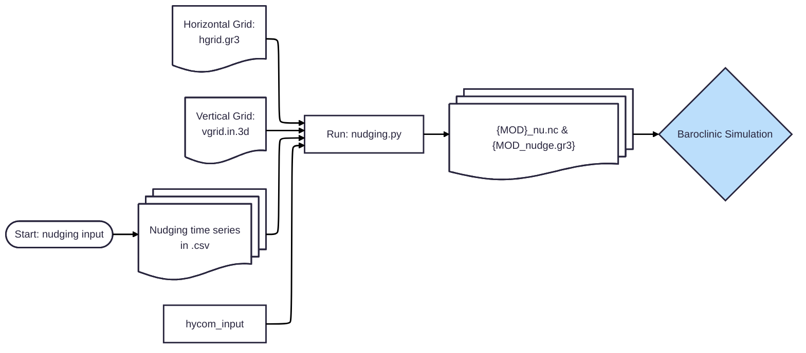

```mermaid
---
config:
  look: classic
  theme: redux
  layout: elk
---
flowchart LR
    hgrid["Horizontal Grid: 
            hgrid.gr3"] --> nudge_py["Run: nudging.py"]
    vgrid3["Vertical Grid:
            vgrid.in.3d"] --> nudge_py
    nudge(["Start: nudging input"]) --> nudge_ts["Nudging time series 
                        in .csv"]
    nudge_ts --> nudge_py
    nudge_py --> nudge_nc["{MOD}_nu.nc & {MOD_nudge.gr3}"]
    hycom_input["hycom_input"] --> nudge_py
    nudge_nc --> baroclinic{"Baroclinic Simulation"}
    hgrid@{ shape: doc}
    vgrid3@{ shape: doc}
    nudge_ts@{ shape: docs}
    nudge_nc@{ shape: docs}
    style baroclinic fill:#BBDEFB
    click hgrid "https://cadwrdeltamodeling.github.io/BayDeltaSCHISM/topics/mesh.html#"
```